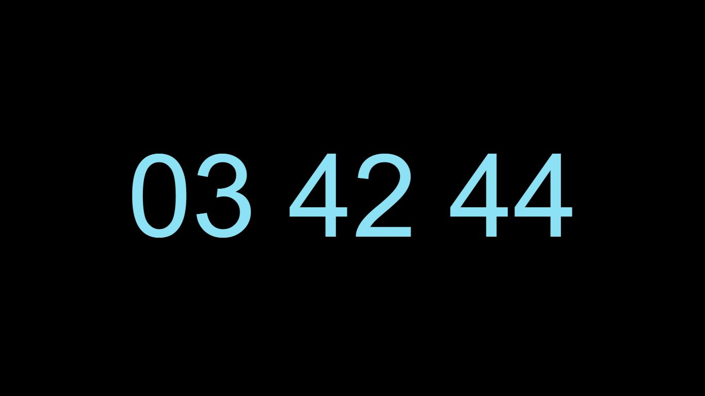

# CruelMinimalClock

CruelMinimalClock is a  Windows Screensaver which works with all versions of windows including windows 10,8.1,8,7.  

###Features

* Clock color changes with pulse effect
* Using Pt sans font which is mostly available
* Black Background look for low screen power usage
* Minimal looks

###Steps to use
1. Clone this repro to any location or download .zip using this link
2. copy index.html and progs/sscr.scr to C:\windows\ 
3. right click on sscr.scr and click configure
4. browse and select index.html then click save
5. right click on sscr.srv and click install
6. Use it like any other screen saver

######| This tutorial uses third party applications.
